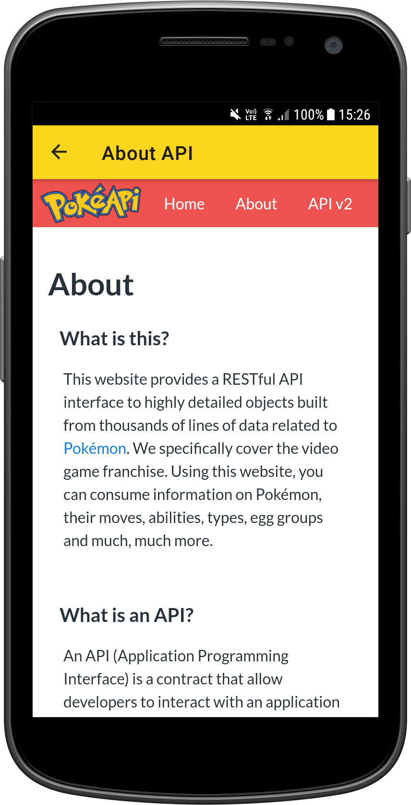

# PokemonApp

My solution of the test task from a company

The task:

Build an application to work with the API https://pokeapi.co/docs/v2

The application should consist of:

1. splash screen

2. menu, contains two buttons with transitions to screens 3 and 4

3. search Pokemon by name screen, contains a Pokemon name input field and a search button. Found Pokemon can be added to favorite Pokemon list

4. the screen for displaying a random Pokemon, by clicking on the button should be displayed information about the random Pokemon. Found Pokemon can be added to favorite Pokemon list

5. favorite Pokemon list screen - a list of Pokemons added to the favorite Pokemon list

6. design - at the discretion of the developer.

The application must be a single activity with fragments (no more than one activity in the whole application)

Kotlin

MVVM (architecture)

Retrofit (networking)

RxJava2 (3) and coroutines (working with multithreading)

Koin or Dagger2 (di dependency injection)

Navigation Architecture Component or Cicerone (fragment navigation)

DB - Room or Firebase

For each screen, create a separate branch and, after completion, merge in master (working with git)

Project structure - preferably clean architecture

Requied theoretical knowledge of Java core and Android SDK (lifecycles, main components, etc.).

  

